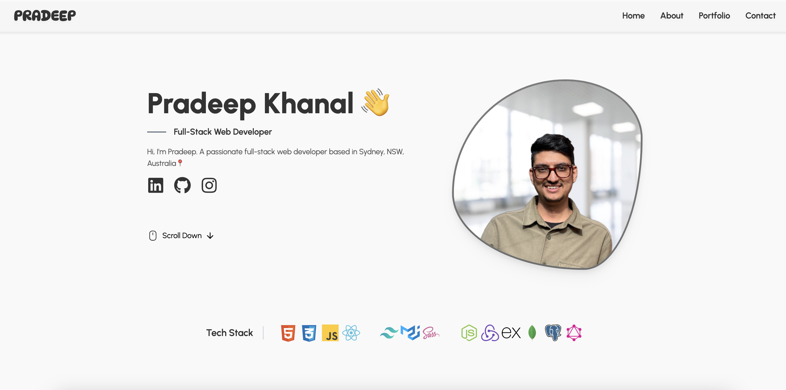
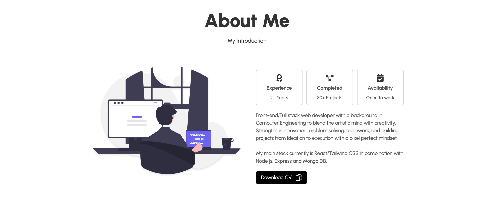

# Pradeep Khanal's Portfolio

Welcome to my portfolio! This project showcases my skills, experience, and recent work as a Frontend Developer.

## Live Demo

Live demo link is available [here.](https://pradeepkhanaltech.netlify.app/)

_Description: The hero page of my portfolio website._

_Description: The about page of my portfolio website._

_Description: The contact page of my portfolio website._

## Features

- Responsive Layout
- Fixed Navigation
- Pop-up modals
- Tab panel
- Contact Form

## Technologies Used

1. React.js
2. Tailwind CSS
3. Vite (for building)
4. Emailjs (for contact services)
5. React icons

# Credit

Special mention to Cryptical Coder for this elegant design idea. It can be found [here](https://www.youtube.com/c/CrypticalCoder).Also this is the youtube [channel](https://www.youtube.com/c/CrypticalCoder) if you like to give it a try as well.
